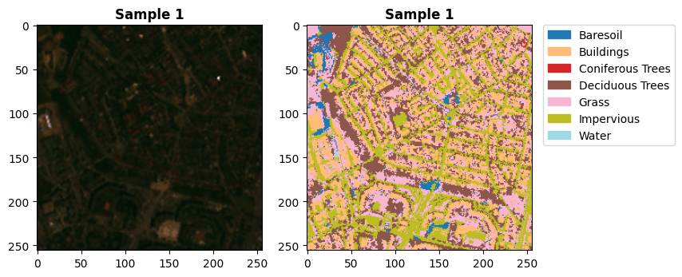
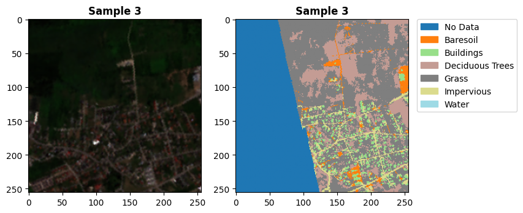

## Example of how to use SegmentationRasterDataset:

```python
from eotorch.datasets.geo import get_segmentation_dataset
from eotorch.plot.plot import plot_samples

class_mapping = {
    1: "Baresoil",
    2: "Buildings",
    3: "Coniferous Trees",
    4: "Deciduous Trees",
    5: "Grass",
    6: "Impervious",
    7: "Water",
}
ds = get_segmentation_dataset(
    images_dir="dev_data/sr_data",
    labels_dir="dev_data/labels",
    all_image_bands=("B02", "B03", "B04", "B08", "B11", "B12"),
    rgb_bands=("B04", "B03", "B02"),
    class_mapping=class_mapping,
)
plot_samples(ds, n=2, patch_size=256)
```


